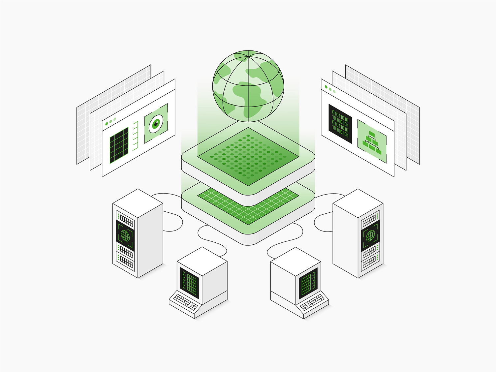
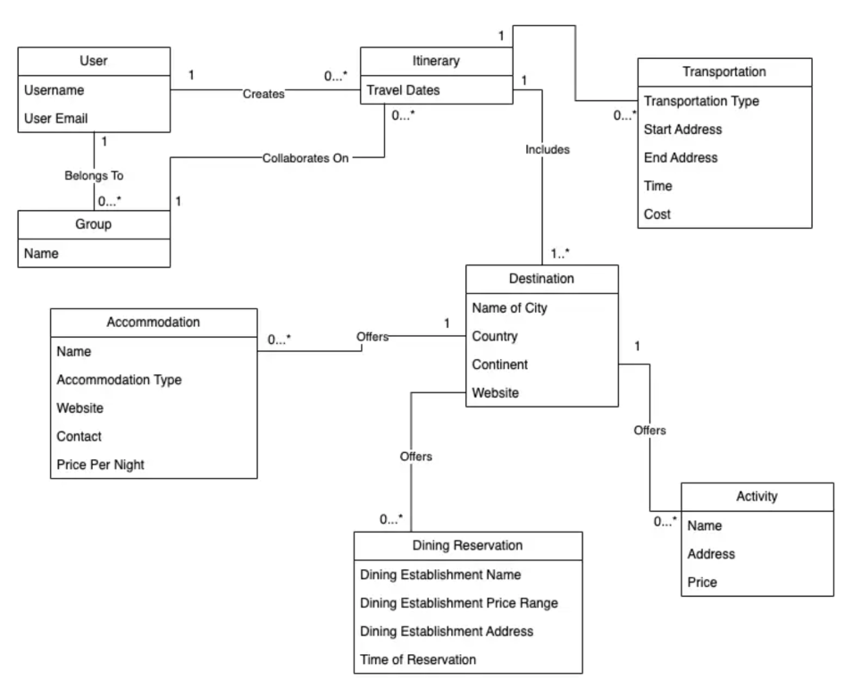
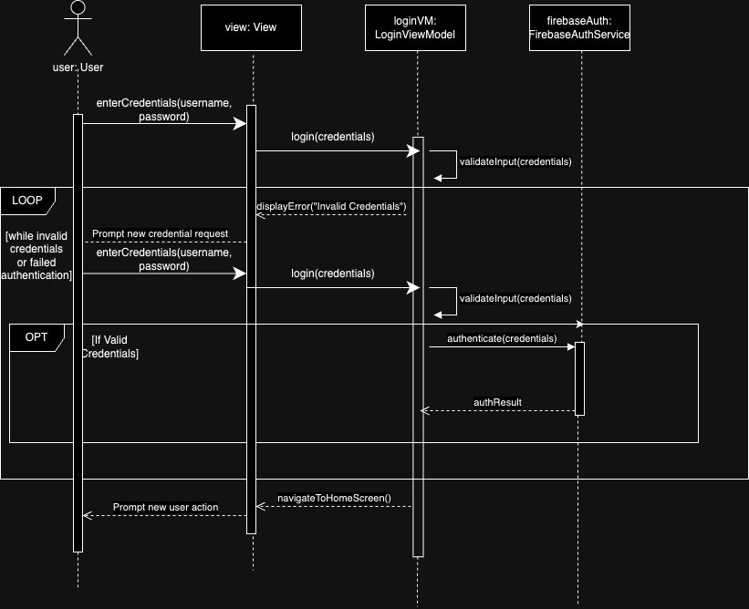
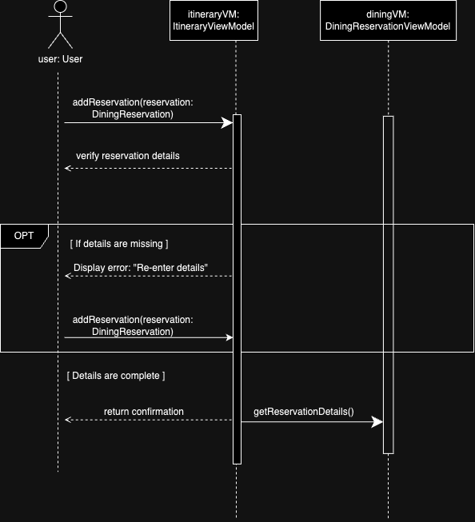

<!DOCTYPE html>
<html lang="en">
<head>
    <meta charset="UTF-8">
    <meta name="viewport" content="width=device-width, initial-scale=1.0">
    <title>Design & Architecture</title>
    <link rel="stylesheet" href="styles.css">
</head>
<body>
    <section class="container">
        <h2>Wander into our architecture</h2>
        
At WanderSync, we transform your travel dreams into reality with innovative design and seamless functionality. Our MVVM architecture is crafted to provide an intuitive and delightful user experience, ensuring proper seperation of concerns with every journey being memorable and hassle-free.

    </section>
    <section class="container b-padding">
        <a href="ui.md">
            User Interface
        </a>
    </section>
    <section>
        
    <section>
    <section class="container">
        

            
WanderSync employs several design patterns to ensure efficient and scalable architecture. The Model View ViewModel structure ensures efficient data binding between the UI and the underlying business logic.

            
Throughout the sprints, we implemented the Observer Pattern to update the UI in real-time when new data is added to the database. The dining reservation and travel community page both implement this pattern. The Singleton Pattern is used to manage the DatabaseManager, ensuring a single instance for consistent data handling.

        

    </section>
    <section class="container">
        <table class="tab">
            <tr class="top-border">
            <td class="t-padding">
                    Domain Model
                </td>
                <td class="td-padding">
                    

                        The domain model represents the core entities and relationships in the Wanderly system.
                    

                    

                        Introduces classes like Dining Reservation / Transportation . 
                    

                    

                        Supports collaborative trip planning.
                    

                </td>
            </tr>
            <tr class="top-border">
                <td class="t-padding">
                    Design Class Diagram
                </td>
                <td class="td-padding">
                    

                        A more technical Domain Model with attributes and methods.
                    

                    

                        Shows relationships like aggregation, composition, and dependency.
                    

                </td>
            </tr>
            <tr class="top-border">
                <td class="t-padding">
                    Sequence Diagram: Login
                </td>
                <td class="td-padding">
                    Illustrates the user login process, including interactions for credential validation and navigation to the home screen.
                </td>
            </tr>
            <tr class="top-border">
                <td class="t-padding">
                    Sequence Diagram: Dining
                </td>
                <td class="td-padding">
                    

                        Shows the flow of adding a dining reservation, from user input to storing details in the database.
                    

                    

                        Includes error handling and confirmation of successful reservation creation.
                    

                </td>
            </tr>
        </table>
    </section>
    <section class="container">
        

            
            
            
            
        

   </section>
</body>
</html>