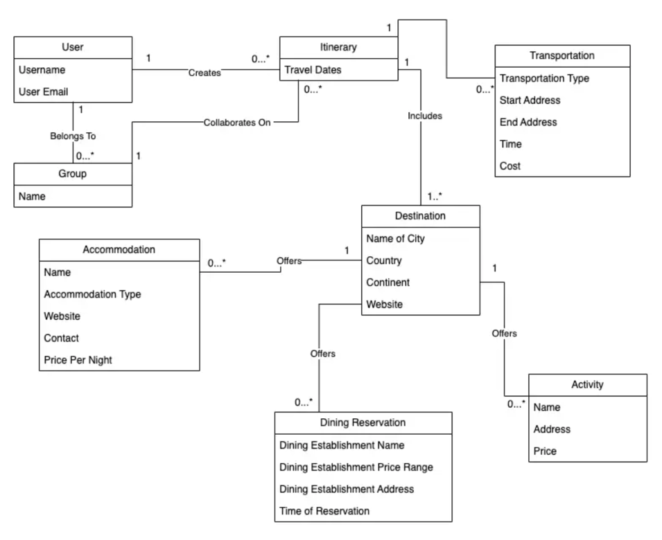
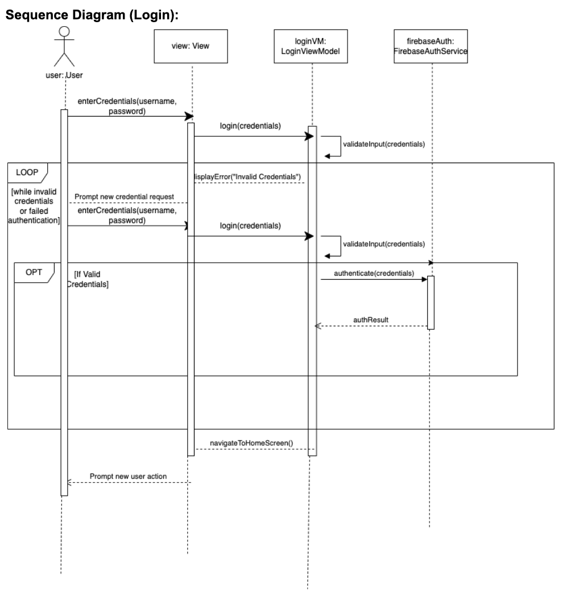

# Design & Architecture

## Overview
The architecture of WanderSync is built on the **Model-View-ViewModel (MVVM)** pattern to ensure a clean separation of concerns and scalability.

### Design Patterns Used
1. **Singleton Pattern**
   - **Purpose**: Ensures only one instance of a class is created, providing a global point of access.
   - **Implementation in WanderSync**:
     - Applied in Sprint 2 to manage the `DatabaseManager` for all interactions with Firebase. This ensures consistent and efficient handling of user and travel data.

2. **MVVM**
   - **Purpose**: Ensures efficient data binding between the UI and the underlying logic.

3. **Observer Pattern**
   - **Purpose**: Establishes a subscription mechanism to notify dependent objects when changes occur.
   - **Implementation in WanderSync**:
     - Introduced in Sprint 3 and expanded in Sprint 4 to update the UI in real-time when new data (e.g., dining reservations or community posts) is added to the database.
     - Used to reflect immediate changes in the Travel Community and collaboration features.

4. **Strategy Pattern**
   - **Purpose**: Defines a family of algorithms, encapsulates each one, and makes them interchangeable at runtime.
   - **Implementation in WanderSync**:
     - Employed in Sprint 3 to sort and filter dining and accommodation reservations. Users can sort by time, date, or type of reservation.

5. **Factory Method Pattern**
   - **Purpose**: Provides an interface for creating objects while allowing subclasses to specify the type of object to create.
   - **Implementation in WanderSync**:
     - Mentioned in Sprint 4 to streamline the creation of travel posts. Used to generate different types of entries (e.g., accommodations, dining reservations) based on user inputs.

## UML Diagrams

### **1. Domain Model V1**
The initial domain model created during Sprint 1 focuses on the foundational structure of the WanderSync application. It includes essential classes like `User`, `Destination`, and `Transportation` with their attributes and relationships.

---

### **2. Domain Model V2**
Refined in Sprint 2, this domain model introduces new classes such as `TravelLog` and expands associations to reflect additional features like travel logging and collaborative trip planning.

---

### **3. Design Class Diagram (DCD)**
The DCD created in Sprint 3 includes classes for managing dining and accommodation reservations. It reflects relationships such as aggregation, composition, and dependency between classes like `User`, `Itinerary`, `DiningReservation`, and `AccommodationReservation`.

---

### **4. Sequence Diagram (SD): Login**
This sequence diagram illustrates the user login process, including interactions between the `User`, `LoginViewModel`, and `FirebaseAuthService`. It ensures proper credential validation and navigation to the home screen upon successful login.

---

### **5. Sequence Diagram / Use Case Diagram: Add Dining Reservation**
This sequence diagram demonstrates the flow of adding a dining reservation, starting from user input to storing the reservation details in the database. It includes error handling for incomplete or invalid details and confirmation of successful reservation creation.

