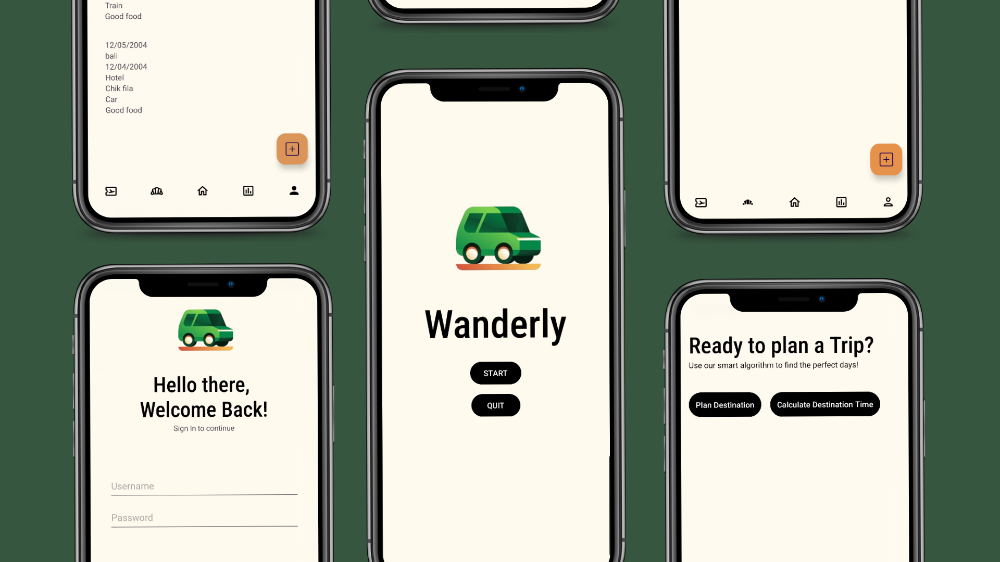

<!DOCTYPE html>
<html lang="en">
<head>
    <meta charset="UTF-8">
    <meta name="viewport" content="width=device-width, initial-scale=1.0">
    <title>Wanderly</title>
    <link rel="stylesheet" href="styles.css">
</head>
<body>
    <section>
        
    </section>
    <section class="container">
        <h2>Let your mind wander,   while we take care of the rest</h2>
        

            
Welcome to the Wanderly project showcase. This website highlights the intricate details and functionalities of the android app, reflecting the effort and innovation embedded within the project. Explore the various parts of Wanderly, starting from the &#128507; destination page to &#127865; booking a dining reservation to &#9978; staying at a hotel. You are also able to &#129499; add people to your group and &#128228; publish your destination details.

        

        

            <a href="introduction.md">
                Learn More
            </a>
        

    </section>
</body>
</html>
