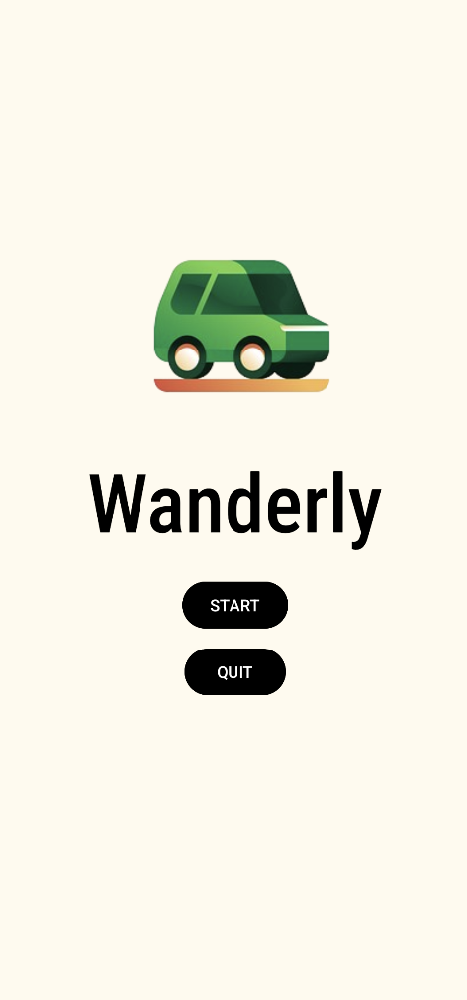
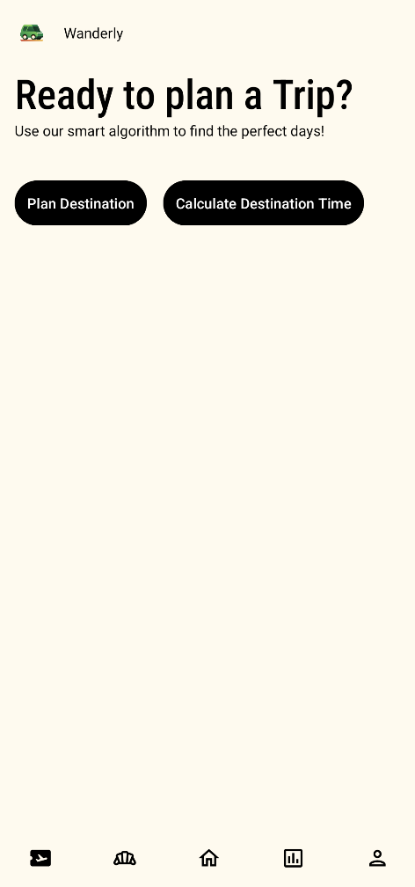

## User Interface (UI)

### **Overview**
The **WanderSync** application features a clean and intuitive user interface (UI) designed to enhance the travel planning experience. Each screen focuses on user-friendly interactions and clear presentation of functionalities.

---

### **Screens**

1. **Login and Registration Screen**
   - **Purpose**: Allow users to create accounts or log in securely.
   - **Features**:
     - Input fields for username, email, and password.
     - Error handling for invalid credentials (e.g., incorrect password or unregistered accounts).
     - Firebase authentication integration.
   - **Screenshot**:
     

---

2. **Home Screen**
   - **Purpose**: Serve as the central navigation hub for accessing different functionalities.
   - **Features**:
     - Navigation bar linking to the Logistics, Destinations, Dining, Accommodation, and Community screens.
     - Overview of active trips and upcoming events.
   - **Screenshot**:
     

---

3. **Destination Screen**
   - **Purpose**: Log, view, and manage travel destinations.
   - **Features**:
     - Form to log trips with destination name, start date, and end date.
     - Error validation for input dates.
     - List of logged destinations with trip durations.
     - Prepopulated example entries for demonstration purposes.
   - **Screenshot**:
     

---

4. **Logistics Screen**
   - **Purpose**: Manage overall trip logistics, including vacation time and collaborators.
   - **Features**:
     - Visualization of allotted vs. planned vacation days using charts (e.g., MPAndroidChart).
     - Button to invite collaborators and display a list of contributors to a trip.
     - Options for adding and viewing trip notes.
   - **Screenshot**:
     

---

5. **Dining Screen**
   - **Purpose**: Add and manage dining reservations.
   - **Features**:
     - Form to log dining reservations, including restaurant name, website, and reservation time.
     - Scrollable list of existing reservations, sorted by date and time.
     - Filters to organize entries by location or date using the **Strategy Pattern**.
   - **Screenshot**:
     

---

6. **Accommodation Screen**
   - **Purpose**: Add and manage accommodation details.
   - **Features**:
     - Form to log accommodations, including hotel name, check-in/out dates, room type, and cost.
     - Scrollable list of accommodations with options to sort by check-in/out dates.
     - Mark past reservations for easy identification.
   - **Screenshot**:
     

---

7. **Travel Community Screen**
   - **Purpose**: Collaborate with the community and share travel experiences.
   - **Features**:
     - List of travel posts from the community database with trip details, including destinations, accommodations, dining, and notes.
     - Option to add posts, including itinerary details and reflections.
     - Real-time updates using the **Observer Pattern** for new posts.
   - **Screenshot**:
     

---

### **Navigation and Interaction**
- **Navigation Bar**: Persistent across all screens to allow quick access.
- **Interaction Flow**: Each screen's features are logically connected to streamline the user's workflow, from logging a trip to sharing it with the community.

### **Visual Highlights**
- **Charts**: Interactive visualizations for logistics and trip planning.
- **Forms**: Clean and validated input fields for all user-submitted data.
- **Lists**: Scrollable lists with sorting and filtering options for seamless data management.

